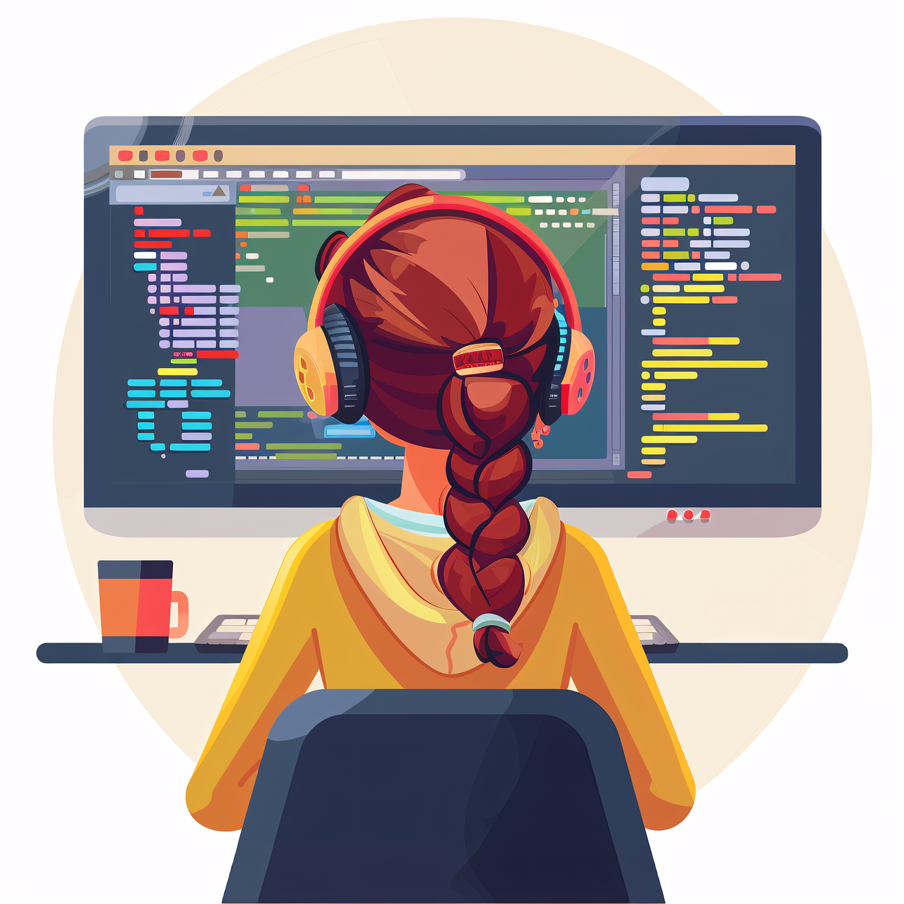

## Giselly Souza
(  Javascript | Typescript | React JS | HTML | CSS ) 🚀
- 👩‍💻 Desenvolvedora Full Steak em formação
- 🎓 Estdante de na escola de Tecnologia DNC (https://www.escoladnc.com.br/)
- 🌐 Apaixonada por novos desafios!!
- 💡 Adoro aprender coisas novas!
    

  

  

  
 

 
  
   
  

 

  <h3>Habilidades</h3>
  
  

  <h3>Minhas ferramentas de programação</h3>

  

